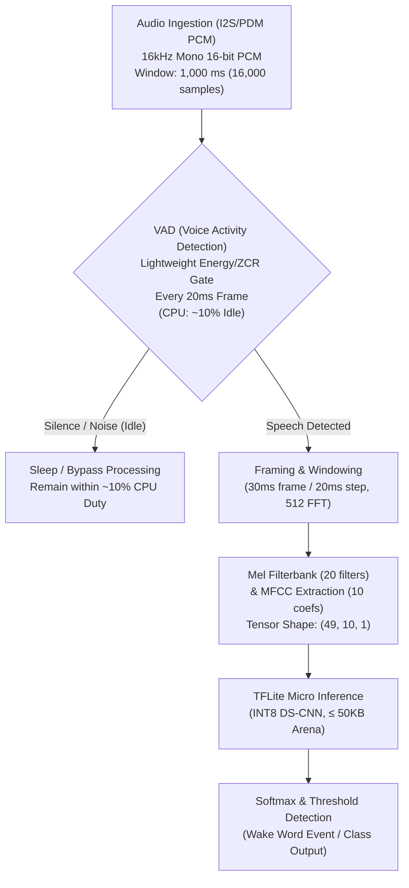

# Swara Architecture Documentation & Progress Tracker

## 1. System Overview & Hard Constraints

**Swara** is an edge voice recognition and wake detection system purpose-built for ultra-low-power, resource-constrained edge/TinyML devices (e.g. ARM Cortex-M, ESP32, RISC-V). 

The system is governed by the following **non-negotiable hard constraints**:

| Constraint | Requirement | Architectural Strategy |
| :--- | :--- | :--- |
| **Runtime Implementation** | **C/C++ only** | All runtime code, audio drivers, DSP, VAD, feature extraction, and inference run natively in C/C++. No runtime interpreter. |
| **Total Memory Budget** | **$\le 256\text{ KB}$** | Entire footprint (Flash code + INT8 weights + Tensor Arena + PCM ring buffer + MFCC scratch + stack) fits strictly within $\le 256\text{ KB}$. |
| **Idle CPU Usage** | **$\approx 10\%$ CPU** | Front-end lightweight VAD runs every frame with minimal cycle cost. MFCC and DS-CNN inference remain dormant until speech is confirmed. |
| **Deployment Target** | **Edge / TinyML** | Embedded bare-metal firmware and RTOS environments (FreeRTOS, Zephyr, TFLite Micro). |
| **Inference Engine** | **INT8 DS-CNN** | Depthwise Separable Convolutional Neural Network with full symmetric 8-bit integer quantization. |
| **Audio Pipeline** | **PCM $\rightarrow$ VAD $\rightarrow$ MFCC $\rightarrow$ DS-CNN $\rightarrow$ Wake** | Voice Activity Detection (VAD) gates the computationally intensive MFCC and neural network stages. |
| **Role of Python** | **Optional external tooling only** | Python is strictly an offline tool for training and quantization; it is **never** a runtime project dependency. |

---

### Memory Footprint Budget Breakdown ($\le 256\text{ KB}$)

| Subsystem | Budget Allocation | Description |
| :--- | :--- | :--- |
| **INT8 Model Weights** | `45 - 70 KB` | Quantized DS-CNN weights linked into Flash memory |
| **TFLM Tensor Arena** | `35 - 50 KB` | Working memory for activations and intermediate tensor buffers |
| **PCM Audio Ring Buffer** | `32 KB` | 1,000 ms sliding window of 16-bit PCM samples ($16,000 \times 2\text{ bytes}$) |
| **MFCC & FFT Scratch** | `6 - 10 KB` | 512-point FFT twiddle factors, 20 Mel filter tables, and DCT scratchpad |
| **VAD State & Buffers** | `1 - 2 KB` | Energy thresholds, zero-crossing stats, and hangover counters |
| **Firmware Code & Stack** | `60 - 80 KB` | Compiled C/C++ binary text, RTOS task stack, and static BSS |
| **TOTAL FOOTPRINT** | **$\le 244\text{ KB}$** | **Headroom remaining within $\le 256\text{ KB}$ limit** |

---

## 2. Directory Layout & Module Responsibilities

```text
swara/
│
├── src/                # PRIMARY RUNTIME: Native C embedded implementation
│   ├── audio/
│   │   ├── audio_buffer.c  # Circular ring buffer for 16-bit PCM sliding window
│   │   ├── audio_buffer.h  # Ring buffer API & frozen V0 constants
│   │   ├── vad.c           # [Upcoming] Lightweight energy/ZCR voice activity gate
│   │   └── vad.h           # [Upcoming] VAD header & state definitions
│   │
│   ├── features/
│   │   ├── fft.c           # 512-point Radix-2 Cooley-Tukey FFT & Hanning window
│   │   ├── fft.h           # FFT API, twiddle factors & power spectrum
│   │   ├── mfcc.c          # 20 Mel filterbanks & 10 DCT-II cepstral coefficients
│   │   └── mfcc.h          # MFCC extraction API & sparse filter structures
│   │
│   ├── model/
│   │   ├── classifier.c    # [Upcoming] INT8 TFLM model execution & thresholding
│   │   └── classifier.h    # [Upcoming] Classifier interface
│   │
│   └── main.c              # [Upcoming] Embedded application loop & wake event handler
│
├── tests/              # Native C verification & unit test suites
│   ├── test_audio_buffer.c # Ring buffer capacity, extraction & wrap-around tests
│   ├── test_fft.c          # FFT twiddle, bit-reversal & sine tone frequency tests
│   └── test_mfcc.c         # Mel filterbank, log-compression & DCT tests
│
├── models/             # Frozen model binaries & deployment C arrays
│   ├── swara_float32.tflite
│   └── swaral_int8.tflite
│
├── deployment/         # TFLite Micro model byte arrays
│   ├── model_data.cc
│   └── model_data.h
│
├── training/           # OPTIONAL external tooling (Python offline development)
│   ├── train.py
│   ├── model.py
│   ├── dataset.py
│   ├── evaluate.py
│   └── quantize.py
│
├── data/               # Offline training & validation datasets
│   ├── raw/
│   ├── processed/
├── tools/              # Offline developer utilities & visualization
│   ├── dashboard.py    # Interactive CLI dashboard (audit, explore channels, benchmarks, parity)
│   └── wav_visualizer/ # Windows desktop WAV & MFCC inspection GUI
│
├── CMakeLists.txt      # Root build configuration for runtime & test suites
├── architecture.md     # Architecture specifications, hard constraints & change log
└── README.md           # Project documentation and developer reference
```

---

## 3. Data & Inference Pipeline



### Frozen Audio Specification (V0)

| Parameter | Value | Description |
| :--- | :--- | :--- |
| **Sample Rate** | `16,000 Hz` | Acoustic sampling rate |
| **Channels** | `1` | Mono |
| **Sample Format** | `signed 16-bit PCM` | Standard linear PCM (`int16_t`) |
| **Window Duration** | `1,000 ms` | 1 second analysis window |
| **Samples per Window** | `16,000` | $16,000 \times 1.0\text{s}$ |
| **Frame Length** | `30 ms` | 480 samples @ 16 kHz |
| **Frame Step (Hop)** | `20 ms` | 320 samples @ 16 kHz |
| **FFT Size** | `512` | Radix-2 FFT size covering 480 samples |
| **Mel Filters** | `20` | Triangular Mel-spaced filterbanks |
| **MFCC Coefficients** | `10` | First 10 discrete cosine transform coefficients |
| **Output Feature Matrix** | `(49, 10, 1)` | 49 time frames $\times$ 10 MFCC coefficients $\times$ 1 channel |

### Component Details
1. **Audio Ingestion (`data/`):**
   - Ingests single-channel 16 kHz signed 16-bit PCM.
   - Slices continuous audio stream or audio files into 1.0-second (16,000 samples) windows.
2. **Feature Extraction (`training/dataset.py`):**
   - Applies Hanning window over 480-sample frames.
   - 512-point FFT yields 257 frequency bins.
   - Filters through 20 Mel banks and computes log-energy.
   - Computes DCT-II to obtain 10 MFCC coefficients per frame.
   - Yields an input tensor of shape `(49, 10, 1)`.
3. **Model Architecture (`training/model.py`):**
   - Depthwise Separable Convolutional Neural Network (DS-CNN).
   - Input shape: `(49, 10, 1)`.
   - Target parameter size: ~20k to 35k parameters to satisfy Flash footprint < 100 KB.
4. **Quantization (`training/quantize.py`):**
   - Post-Training Quantization (PTQ) to 8-bit signed integers (`int8`).
   - Representative dataset supplied during calibration to map dynamic activation ranges.
5. **Edge Deployment (`deployment/`):**
   - Converted `.tflite` model serialized as C++ byte array in `model_data.cc`.
   - Imported into embedded projects and registered with `tflite::MicroInterpreter`.

---

## 4. Architecture Progress & Milestones

| Milestone | Description | Status | Target Date | Notes |
| :--- | :--- | :--- | :--- | :--- |
| **M0: Scaffold** | Set up repository layout, training modules, model stubs, deployment headers, and architecture tracker | **Completed** | 2026-09-10 | Baseline structure established |
| **M1a: C Audio Front-End** | Native C `audio_buffer`, `fft` (512 Radix-2), and `mfcc` (20 Mel, 10 DCT) modules with 100% test pass | **Completed** | 2026-09-10 | Zero dynamic allocation, verified with CTest |
| **M1b: VAD & WAV $\rightarrow$ MFCC** | Energy-based VAD, native WAV parser, pre-emphasis (0.97), Hamming window, full 49x10 feature matrix extractor & benchmarks | **Completed** | 2026-09-10 | Tested on Silence, 1kHz Tone, Speech WAVs. 0.50 ms / 1s audio |
| **M2b.1: Feature Parity & Contract Audit** | Synchronization of C and Python DSP (pre-emphasis 0.97, Hamming, natural log), numerical parity verification (max err < 0.05), and recording-level split contract | **Completed** | 2026-09-11 | Max abs err: 0.0172, zero leak across splits |
| **M2c: Drive Dataset Import** | Google Drive dataset importer & audit tool (`import_drive_dataset.py`) for raw WAV ingestion | **Completed** | 2026-09-11 | Verified on test manifests; preserves original files |
| **M2c.1: Training & TFLM Infrastructure** | Production-ready training loop (`train.py`), recording-level evaluation (`evaluate.py`), strict INT8 quantization (`quantize.py`), TFLite model inspector (`validate_tflite.py`), C-array exporter (`export_model_header.py`) | **Completed** | 2026-09-11 | 100% CTest pass (7/7) & infrastructure test pass (9/9). Zero fake data. |
| **M2d: Real Model Training** | Train DS-CNN model on real Google Drive dataset once imported | Pending | - | Target high discriminative accuracy (>95%) |
| **M3: INT8 Quantization** | Full INT8 calibration with real representative dataset, verify accuracy preservation | Pending | - | Export verified `swara_int8.tflite` |
| **M4: Microcontroller Deployment** | TFLite Micro C++ integration, latency & memory profiling on target MCU | Pending | - | Target RAM $\le 256\text{ KB}$ |

---

### System Memory Footprint Breakdown ($\le 256\text{ KB}$ Budget)

| Component / Subsystem | Measured / Estimated | Allocation | Description |
| :--- | :--- | :--- | :--- |
| **1-sec PCM Audio Buffer** | **MEASURED** | `32,000 bytes` (31.25 KB) | `int16_t storage[16000]` sliding ring buffer |
| **Audio Buffer Control Struct** | **MEASURED** | `16 bytes` (0.02 KB) | `audio_buffer_t` (capacity, head, count) |
| **FFT Tables (twiddle + window)**| **MEASURED** | `4,996 bytes` (4.88 KB) | Hamming window + Twiddle tables + Bit-reverse |
| **Mel Filters Table** | **MEASURED** | `20,640 bytes` (20.16 KB) | 20 triangular filterbank weights & sparse indices |
| **DCT-II Basis Matrix** | **MEASURED** | `800 bytes` (0.78 KB) | $10 \times 20$ orthogonal cosine matrix |
| **49×10 Feature Buffer** | **MEASURED** | `1,960 bytes` (1.91 KB) | 49 frames × 10 MFCCs (`float32[490]`) |
| **VAD Engine State** | **MEASURED** | `16 bytes` (0.02 KB) | `vad_config_t` thresholds & hangover state |
| **Front-End Stack Scratch** | **MEASURED** | `6,084 bytes` (5.94 KB) | Real/imag FFT scratch buffers + power spectrum |
| **TFLM Tensor Arena (64-ch)** | **ESTIMATED** | `~36,960 bytes` (~36.09 KB)| Working activations memory (DS-CNN 64-channel) |
| *(TFLM Tensor Arena 32-ch Alt)*| **ESTIMATED** | `~20,600 bytes` (~20.12 KB)| Conservative alternative if tighter RAM needed |
| **Firmware Stack & RTOS Overhead**| **ESTIMATED** | `~15,360 bytes` (~15.00 KB)| FreeRTOS task stacks, interrupt stack, BSS |
| **Application State & Queues** | **ESTIMATED** | `~4,096 bytes` (~4.00 KB) | Classification event flags, IPC queues |
| **TOTAL SYSTEM RAM (64-ch)** | **ESTIMATED** | **~122,912 bytes (~120.0 KB)**| **Complies with $\le 256\text{ KB}$ Limit (~136 KB Headroom)** |

*Model weights (~12.2 KB for INT8 64-channel, or ~4.8 KB for INT8 32-channel) reside in Flash ROM (`alignas(16) const unsigned char g_swara_model_data[]`) and do not consume system RAM.*


---

## 5. Architectural Decision Records (ADRs)

### ADR-001: Separation of Data Tiers
- **Decision:** Split `data/` into `raw`, `processed`, and `augmented`.
- **Rationale:** Ensures reproducibility, prevents raw data contamination, and separates computationally heavy feature extraction from training runs.

### ADR-002: Model Architecture Selection (DS-CNN)
- **Decision:** Use Depthwise Separable Convolutions rather than standard 2D convolutions or standard RNNs.
- **Rationale:** DS-CNN reduces compute operations (MACCs) by ~6x-8x while preserving acoustic temporal resolution, optimal for Cortex-M microcontrollers.

### ADR-003: INT8 Full Quantization with C Byte Array Deployment
- **Decision:** Export full INT8 models and pack into `deployment/model_data.cc` and `model_data.h`.
- **Rationale:** Direct C byte arrays require no filesystem on bare-metal firmware and link directly into read-only memory (Flash).

### ADR-004: Audio Specification V0 Freeze
- **Decision:** Freeze the audio ingestion and front-end DSP parameters to 16 kHz sample rate, mono 16-bit PCM, 1,000 ms window (16,000 samples), 30 ms frame length (480 samples), 20 ms frame step (320 samples), 512 FFT size, 20 Mel filterbanks, and 10 MFCC coefficients, yielding a feature input shape of `(49, 10, 1)`.
- **Rationale:** Freezing the front-end guarantees absolute synchronization between offline Python dataset generation and online C/C++ bare-metal DSP on microcontrollers. 10 MFCCs and 20 Mel filters drastically reduce compute overhead and RAM compared to larger feature spaces while maintaining high discriminative accuracy for keyword spotting.

### ADR-005: Hard Constraints — C/C++ Native Runtime, ≤ 256 KB Budget, and VAD-Gated 10% Idle CPU
- **Decision:** Establish non-negotiable embedded constraints from day one:
  1. The runtime is strictly C/C++; Python is purely external offline tooling.
  2. The entire system memory footprint (Flash binary + model weights + Tensor Arena + PCM ring buffer + MFCC scratch + stack) is constrained to $\le 256\text{ KB}$.
  3. Idle CPU usage must remain at $\approx 10\%$ through a two-stage pipeline: a lightweight VAD gates the pipeline, keeping MFCC and INT8 DS-CNN inference dormant during silence/noise.
- **Rationale:** Designing for Python first and porting to C/C++ later leads to bloated tensor arenas and unacceptable idle power drain. Designing around the 256 KB / 10% CPU budget upfront forces deterministic memory layout, static buffer allocation, and aggressive duty cycling.

### ADR-007: Strict Verification Boundaries & Benchmark Labeling
- **Decision:** Explicitly categorize memory and performance metrics into **MEASURED** (front-end C DSP static buffers, WAV parsing, FFT tables) versus **ESTIMATED** (neural network working tensor arena, RTOS overhead). Establish runtime profiling via `interpreter.arena_used_bytes()` as the sole authoritative measurement for TFLM memory once the real INT8 model is deployed.
- **Rationale:** Prevents premature claims of hardware compliance before models are trained on real acoustic data and tested on physical target microcontrollers.

### ADR-008: Centralized Model Hyperparameters (`config.py`)
- **Decision:** Centralize model architecture defaults (`DEFAULT_NUM_FILTERS = 64`, `DEFAULT_NUM_CLASSES = 3`, `DEFAULT_INPUT_SHAPE = (49, 10, 1)`) in `training/config.py`, while defining exploration widths (`[16, 24, 32, 48, 64]`) for future candidate benchmarking.
- **Rationale:** Enables seamless architectural comparisons between 64-channel baseline and lower-RAM candidates (such as 32 channels) across training, evaluation, and export pipelines without scattered manual edits.

---

## 6. Architecture Update Guidelines

When updating the architecture:
1. **Hard Constraint Enforcement:** Reject any feature, layer, or buffer expansion that pushes total system footprint beyond 256 KB or exceeds the 10% idle CPU budget.
2. **C/C++ Primacy:** All runtime algorithms must be implementable in portable, zero-allocation C/C++.
3. **Model Consistency:** Any change to model inputs or quantization parameters must be reflected across offline tools and embedded runtime headers.
4. **Change Logging:** Document all additions, deprecations, or structural refactorings in the **Change Log** below.
5. **Skill Synchronization:** Keep `.agents/skills/swara-architecture/` and `.agents/skills/audio-specification/` aligned with newly introduced conventions.

---

## 7. Change Log

| Date | Version | Author | Description of Changes |
| :--- | :--- | :--- | :--- |
| 2026-09-12 | v0.6.0 | Antigravity | Added tools/dashboard.py: Rich terminal-based interactive dashboard to explore the Swara pipeline, compare DS-CNN architecture channel widths against the <= 256 KB RAM budget, audit datasets, run C benchmarks and parity tests, and simulate dry-run training. |
| 2026-09-11 | v0.5.1 | Antigravity | Hardened dataset ingestion against zero-frame/corrupt audio; implemented content-hash duplicate tracking across recording splits; created training/config.py for centralized channel width management; added ADR-007 and ADR-008; expanded unit tests covering missing classes, corrupt rejection, and flatbuffer header validation. |
| 2026-09-11 | v0.5.0 | Antigravity | Implemented Milestone M2c.1: Training, Quantization & TFLM Infrastructure. Upgraded dataset loader with clean corrupt WAV rejection; hardened train.py, evaluate.py, and quantize.py to require real data and disallow zero/dummy data; created validate_tflite.py and export_model_header.py; confirmed DS-CNN 8-operator compatibility with TFLM; established comprehensive memory budget distinguishing measured C DSP RAM (60.4 KB) from estimated TFLM arena (~36.1 KB); all 7 C tests and 9 Python infrastructure tests passing. |
| 2026-09-10 | v0.4.0 | Antigravity | Implemented Milestone M1b: Added energy-based VAD with hangover smoothing, native RIFF WAV parser (16kHz 16-bit mono), pre-emphasis (0.97), Hamming window, and complete 49x10 MFCC window extractor. Verified on silence, pure tone, and speech WAVs with 0.50 ms / 1s audio execution benchmark. Added ADR-006. |
| 2026-09-10 | v0.3.0 | Antigravity | Implemented native C audio front-end: `audio_buffer` (PCM circular ring buffer), `fft` (512-point Radix-2 Cooley-Tukey with Hanning window), and `mfcc` (20 Mel filters + 10 DCT-II coefficients). Added CMake build system and unit test suites with 100% pass rate. |
| 2026-09-10 | v0.2.0 | Antigravity | Codified Hard Constraints: C/C++ native runtime only, $\le 256\text{ KB}$ total memory footprint, $\approx 10\%$ idle CPU target via VAD gating (`PCM → VAD → MFCC → DS-CNN → wake detection`), Python relegated to optional offline tooling. Added ADR-005 and updated memory budgets. |
| 2026-09-10 | v0.1.1 | Antigravity | Froze Audio Specification V0: 16 kHz, 1-ch, signed 16-bit PCM, 1s window (16,000 samples), 30ms frame / 20ms step, 512 FFT, 20 Mel filters, 10 MFCC coefficients, tensor shape `(49, 10, 1)`. Added ADR-004 and updated skills. |
| 2026-09-10 | v0.1.0 | Antigravity | Initialized project architecture: `data/`, `training/`, `models/`, `deployment/`, `architecture.md`, and `swara-architecture` skill. |


